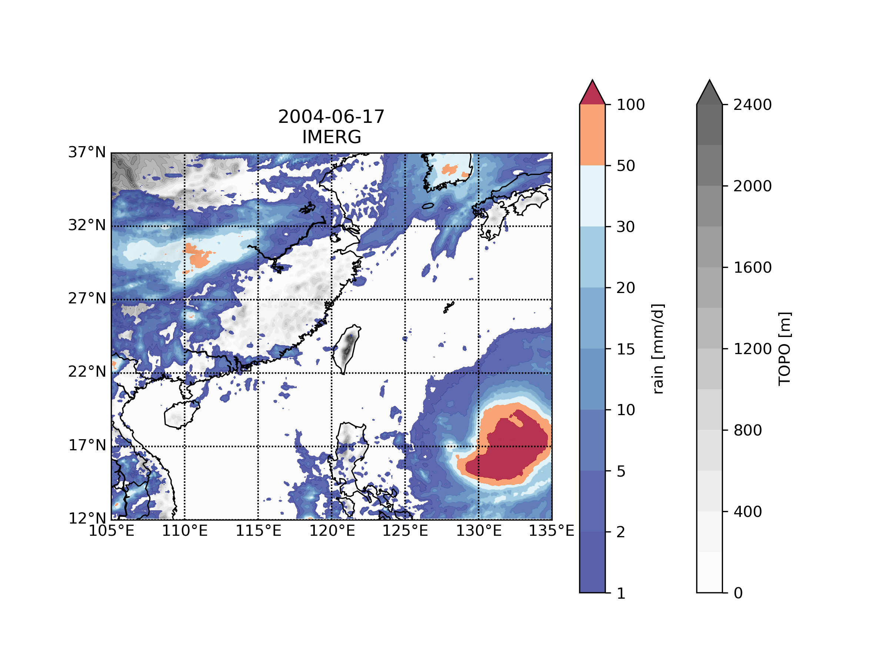
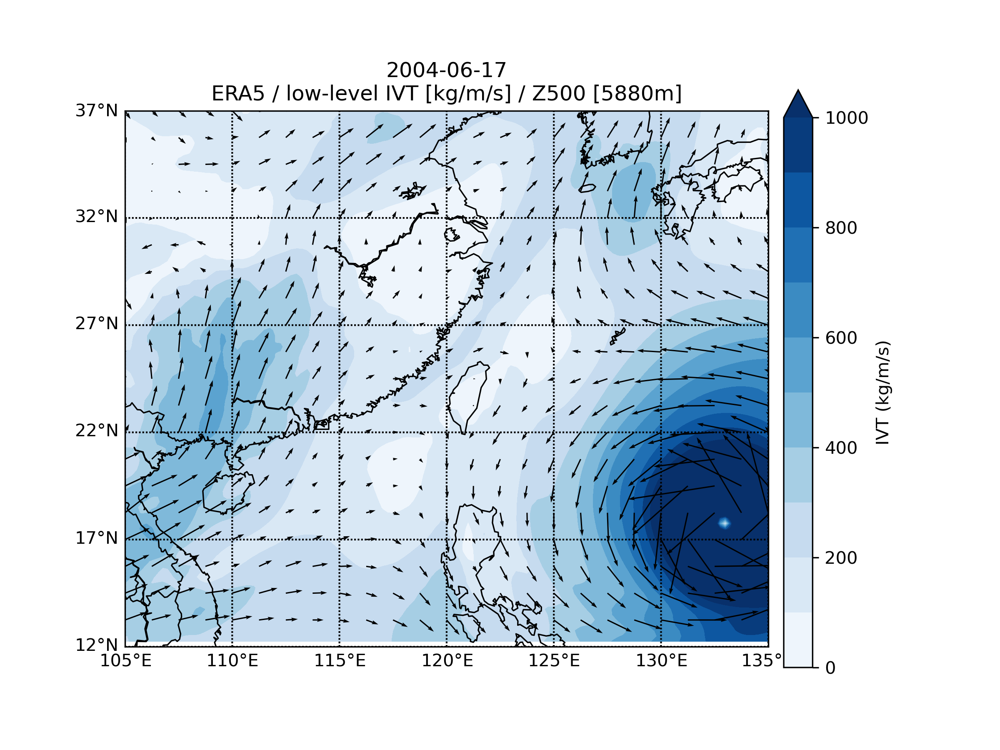
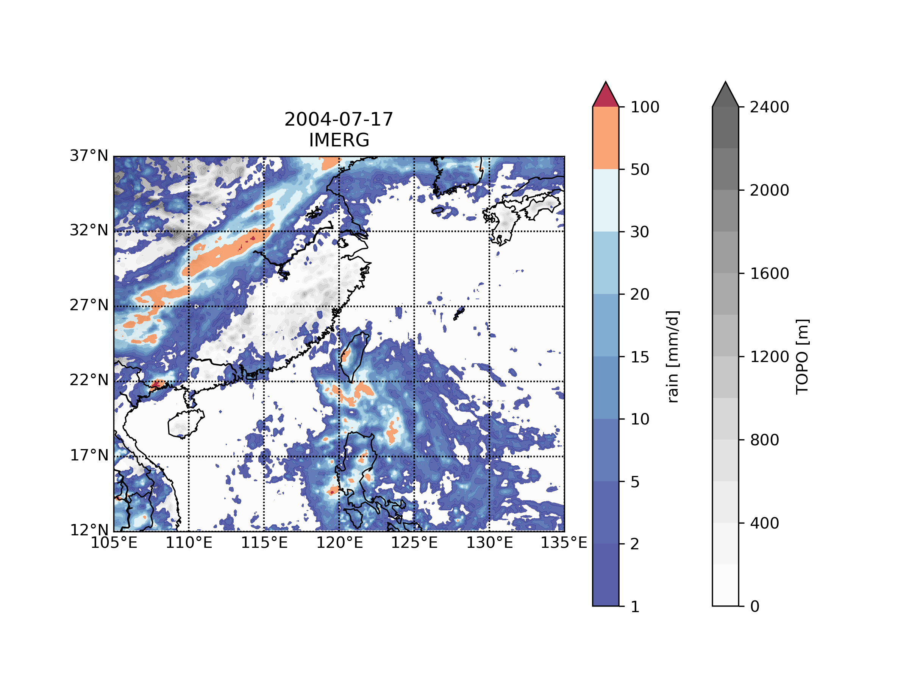
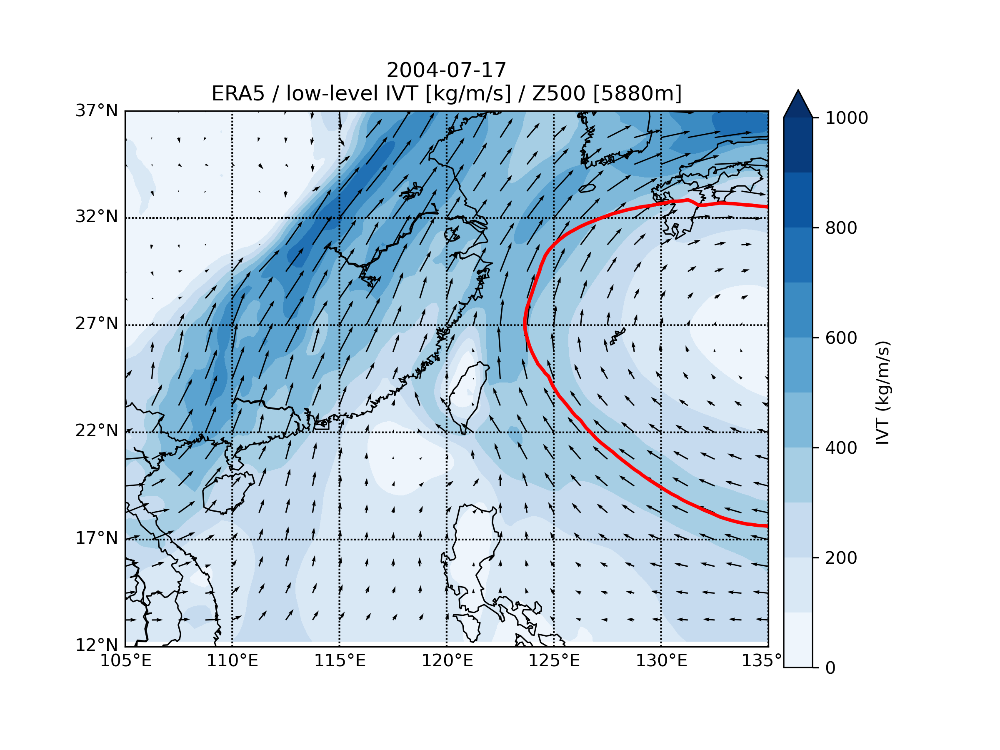
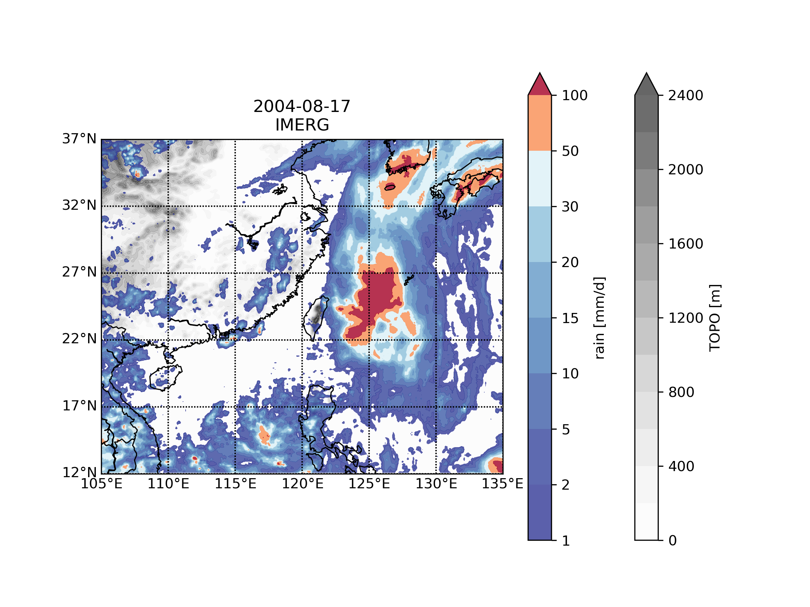
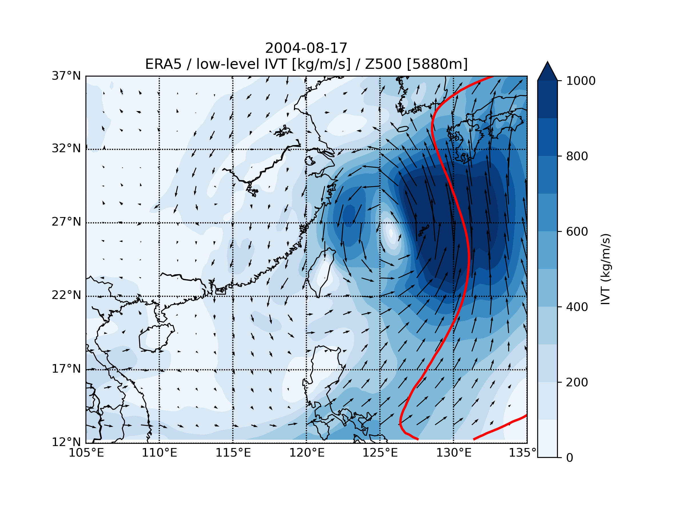
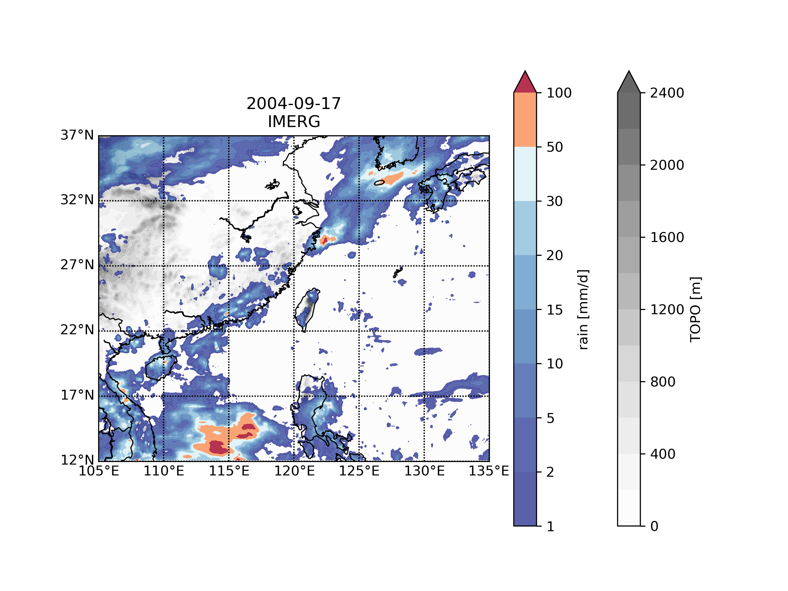
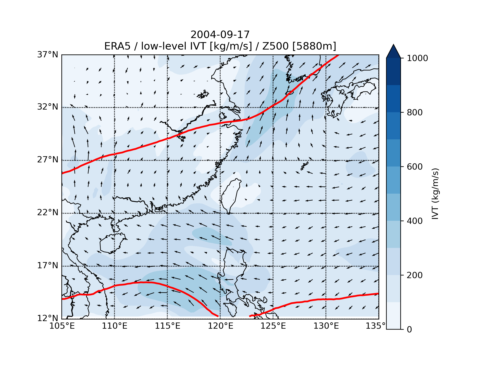

# East Asia Meteorological Data Analysis (2004)

這個專案專注於東亞地區的氣象數據處理與視覺化，包含地形資料提取、降水分布分析以及整層整合水氣輸送 (Integrated Vapor Transport, IVT) 的計算。

##  數據來源
* **ERA5 Reanalysis**: 用於計算 IVT、風場與位勢高度。
* **IMERG (GPM)**: 用於分析高品質的衛星降水資料。
* **ECMWF Topography**: 東亞地區地形高度資料。

## 分析項目
1. **IVT 計算**: 整合低層（700hPa 以下）水氣與風場，分析強降水事件的水氣來源。
2. **降水與地形關聯**: 結合 IMERG 降水與地形圖，觀察地形對對流與降水的影響。
3. **自動化處理**: 使用 `netCDF4` 與 `numpy` 進行大規模數據運算，並透過 `Cartopy` 與 `Basemap` 繪製專業氣象圖表。

## 分析結果 (按月份分類)

> 點擊下方月份展開分析圖表：

<b>6月</b>

### 2004-06 降水與地形

### 2004-06 IVT 與風場

**分析**：可以觀察到當天在台灣東部外海有強勁的颱風，風暴中心有很大的IVT值以及強勁的降水

<b>7月</b>

### 2004-07 降水與地形

### 2004-07 IVT 與風場

**分析**：在中國華中有一條IVT強度帶，對應到降水分布圖的一條降水帶，因此稱為大氣長河

<b>8月</b>

### 2004-08 降水與地形

### 2004-08 IVT 與風場

**分析**：在5880m等高線，也就是太平洋高壓的邊緣上，因台灣東北方氣旋與太平洋高壓邊緣偏南風的分量不斷疊加，形成強大的水氣輸送帶。副熱帶高壓邊緣也像一道牆，將水氣限制在氣旋與高壓之間的狹窄區域

<b>9月</b>

### 2004-09 降水與地形

### 2004-09 IVT 與風場

**分析**：副熱帶高壓的等高線呈現向東北方延伸的趨勢，通常代表其位置較偏東或偏北。在中國華南沿海至日本海有一條延伸的水氣帶，有可能是一條鋒面帶，水氣沿高壓邊緣向東北方輸送

## 開發工具
* **語言**: Python 3
* **核心庫**: `netCDF4` (資料讀取), `numpy` (數值計算)
* **視覺化**: `matplotlib`, `cartopy`, `basemap`
